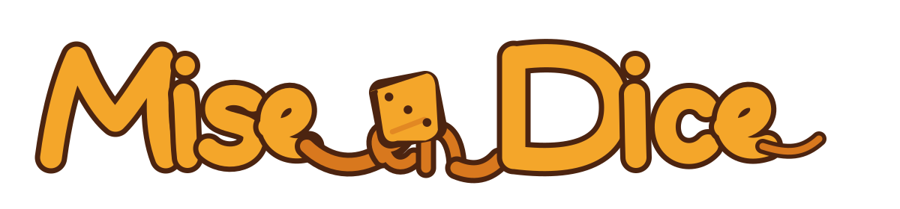
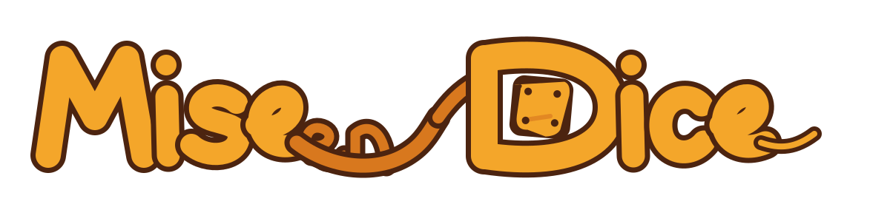
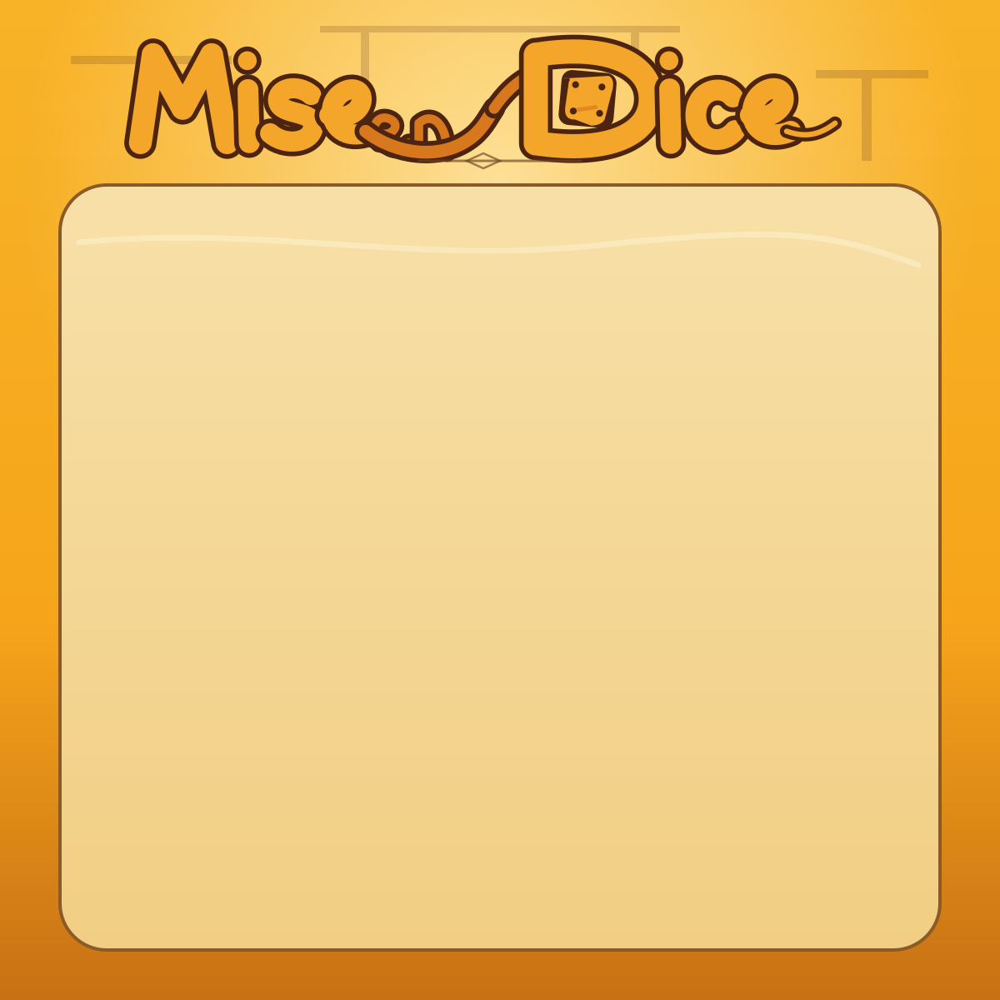
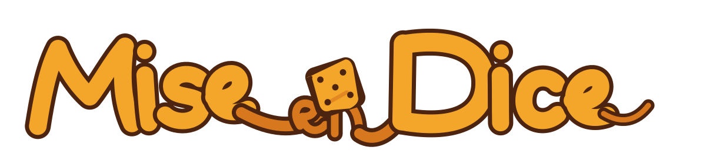
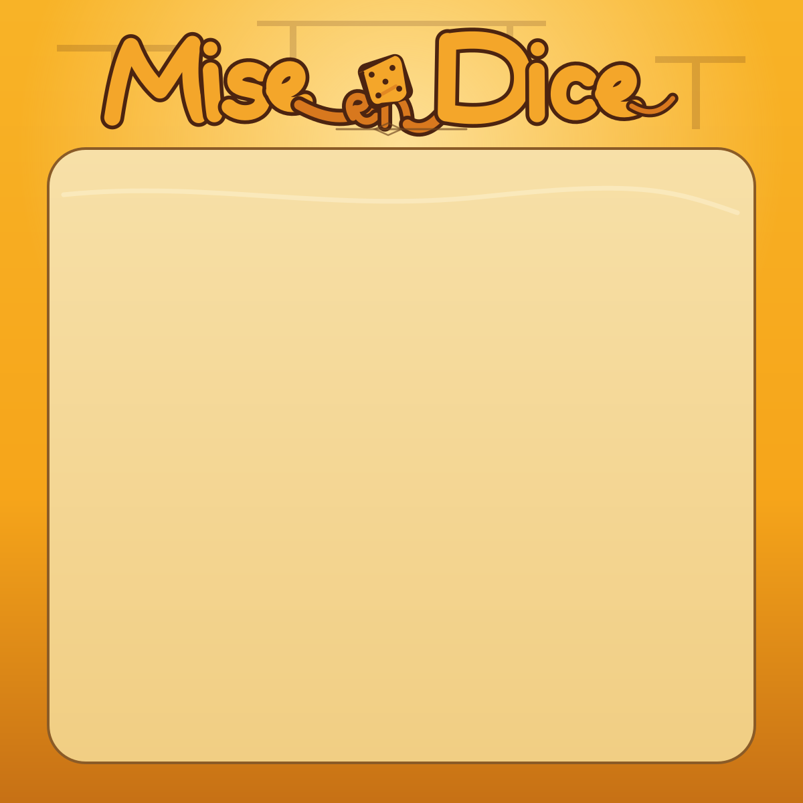

# Expressive `Mise en Dice` Wordmark Studies

Stand: 20. August 2026
Status: Review studies for Issue #130; no production wordmark is selected in this package.

## Direction and common constraints

The former wordmark direction relied on an editorial display font. These studies replace that approach with original custom lettering: warm yellow-orange strokes, a matte dark-brown contour, intentionally controlled curves, and one integrated die per variant. The die is part of the wordmark's construction, not a detached casino ornament.

All studies are SVG-only, have no background in the isolated renderings, need no font file, and use no `<text>` element. `Mise` and `Dice` form the readable primary silhouette. The small `en` is deliberately subordinate and appears only within the connecting flourish.

The direction is informed only by the requested broad qualities—custom lettering, integrated die, a subordinate `en`, a flowing connection, and a warm outlined palette. It is not a recreation of any supplied reference.

## Study A — Looped Die

- **Construction:** fluid, script-like `Mise` and `Dice`; a small three-pip die hangs on the connecting loop. The `en` sits below that loop.
- **Strengths:** most direct expression of playfulness without losing the culinary/editorial warmth; the die is clearly integrated yet does not replace a letter.
- **Risks:** the central connection has the finest detail. At `320 × 320`, it reads as a quiet accent rather than fully legible lettering.

## Study B — Die Counter

- **Construction:** sturdier sign-painter strokes; the four-pip die sits inside the bowl of the capital `D`. `en` is tucked into the incoming sweep.
- **Strengths:** strongest small-format silhouette and the most structurally integrated die; the `D` remains unmistakable even when the die becomes a small colour block.
- **Risks:** most emphatic of the three. The large `D` can feel a little more emblem-like than editorial if the final path refinement is too heavy.

## Study C — Dice Link

- **Construction:** a gently tilted `Mise`, compact five-pip die, and long linking stroke toward `Dice`; `en` is nested on the bridge.
- **Strengths:** most animated overall rhythm and strongest sense that the conjunction joins two equal brand words.
- **Risks:** the most compositionally busy variant. The small `en` and five-pip die compete slightly in the narrow centre at compact size.

## Compact-size review

The files below are explicit `320 × 320` renderings, not CSS-scaled previews. They are the acceptance view for header compatibility.

| Study | Isolated | In Challenge-Card header |
|---|---|---|
| A — Looped Die |  |  |
| B — Die Counter |  |  |
| C — Dice Link |  |  |

## Recommendation

Advance **Study B — Die Counter** to the next, dedicated finalisation package. It holds the clearest `Mise`/`Dice` silhouette at `320 × 320`, puts the die inside the word construction instead of beside it, and keeps the smaller `en` truly subordinate. Study A remains the preferred secondary reference for softening its terminals and curve tension.

## Explicitly deferred

- selecting and expanding the final production wordmark into fill-only SVG paths,
- production asset naming and placement under `assets/brand/`,
- composition of the Challenge-Card mastertemplate,
- any Discord/Bot integration or runtime use.
